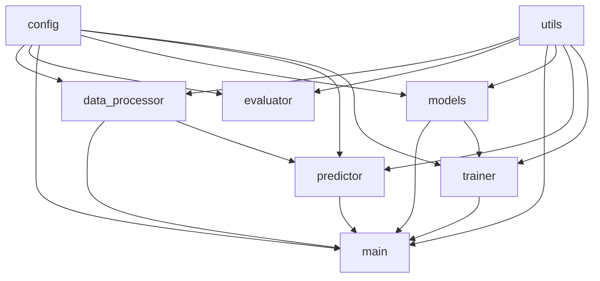

# Part3模块依赖关系报告

## 1. 模块依赖关系图谱

## 2. 模块依赖详情

### data_processor.py
依赖的模块：
- utils.py
- config.py

### evaluator.py
依赖的模块：
- utils.py
- config.py

### main.py
依赖的模块：
- data_processor.py
- config.py
- models.py
- predictor.py
- trainer.py
- utils.py

### models.py
依赖的模块：
- utils.py
- config.py

### predictor.py
依赖的模块：
- utils.py
- config.py
- data_processor.py

### trainer.py
依赖的模块：
- models.py
- utils.py
- config.py

## 3. 依赖统计

总模块数：8
总依赖关系数：18

被依赖次数统计：
- utils.py: 6次
- config.py: 6次
- data_processor.py: 2次
- models.py: 2次
- predictor.py: 1次
- trainer.py: 1次
